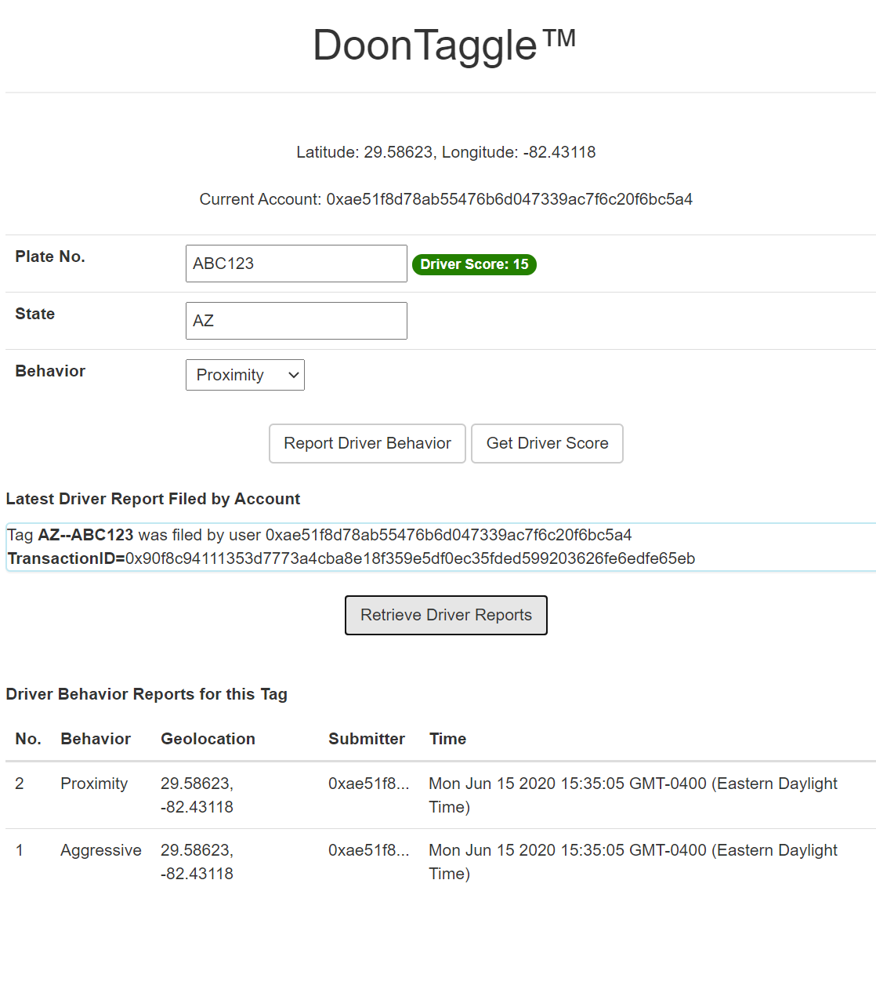

# DoonTaggle

#### Background
The automobile fatality rate is at an all-time high, despite the improved safety features in cars. Data indicates that the primary cause of the increase is excessive speeds and aggressive driving.

## Project Description
The DoonTaggle dApp puts reporting unsafe behavior on the road in the hands of drivers themselves. When drivers observe a Reportable Behavior, they can enter the Plate No. and State of the automobile's license tag, as well as an indicator of the type of behavior.

This information will be recorded on the blockchain along with the time, geolocation of the sender of the report, and the account of the submitter.

As peer-reported driving behavior reports are associated with the driver tag, a Driver Score develops that is computed from the weighted severity of the reported behaviors. Driver report data are also reviewable. Interested parties can use the dApp, for example, to review a Driver's Reports or Score during a routine traffic stop to determine whether the driver deserves a ticket or merely a warning.

#### User Stories
A user can be a Reporter (such as another driver or pedestrian), Audited driver, or other interested party such as a police officer.

A user can Report a driver behavior by entering a Plate No., State, and Behavior indicator from a dropdown set of choices. The user can see proof that the Driver Report was filed by reviewing the Transaction ID of the blockchain transaction.

A user can Retrieve a Driver's score by entering a Plate No. and State of a License Tag. A higher Driver Score indicates a poorer driver. The Driver Score badge changes from green to yellow to red as the Driver Score increases (indicating that the Driver is more hazardous).

A user can Retrieve the most recent ten Driver Reports on a License Tag by entering a Plate No. and State. The Driver reports are returned in LIFO order.

*Note: I am aware that exposure of the geolocation information may be a privacy concern both to the Reporter and the Reported Driver. In a more fully-fledged version of the dApp, the capability for review of Driver Reports would be limited to authorized parties such as police officers, the Reporter's own submitted reports, and a Driver's reports on their own registered/associated license tags. Rather than build an identity verification system into this project, I would likely integrate with uPort or a similar service.*

## Project Architecture
1. The project uses Truffle, Ganache, and the lite-server package to serve the dApp UI. Metamask is a preferred way for authorizing a transaction.

#### Information on Project Requirements
1. There are 8 Solidity-language Tests in test/TestDoonTaggle.sol. Description of the tests are in comments.
2. A Library is implemented as SafeLicenseTags, which is used to validate the alphanumeric format of license tag info.
3. DoonTaggle is deployed on Rinkeby (see deployed_addresses.txt).

## Installation/Setup
1. Download and Launch Ganache GUI from https://truffleframework.com/ganache. This will generate a local development blockchain on local port 7546.
1. Connect MetaMask to the Ganache GUI instance on http://127.0.0.1:7546. If needed, follow the instructions at https://truffleframework.com/tutorials/pet-shop#installing-and-configuring-metamask to configure MetaMask to connect to the Ganache GUI blockchain.
1. Create a directory called "drive-audit" and copy the project to the directory.
1. Install lite-server, if needed (follow instructions at https://medium.freecodecamp.org/how-you-can-use-lite-server-for-a-simple-development-web-server-33ea527013c9)
1. Open a console window inside the "drive-audit" project directory.
2. Run ```truffle compile``` in the project directory.
3. Run ```truffle migrate``` to migrate the contracts to a locally running ganache blockchain. (Use ```--reset``` flag if needed.)
4. Run ```truffle test``` to run the test scripts.

## Running the DoonTaggle dApp
1. Run ```npm run dev``` inside the project directory to launch the dApp UI. A browser (hopefully the one with Metamask installed!) will launch at http://localhost:3001

2. Please GRANT permission to location sharing to see the Geolocation feature.

3. To enter a new driver report, enter the Plate No. and State, and select a behavior from the dropdown. *(Note: Tag Plate Nos. may be only 8 characters and only contain the characters A-Z, a-z, 0-9, space, and -. State may only be two-digit codes of A-Z)*. Click "Report Driver Behavior." Metamask will pop up to confirm the transaction. The "Latest Driver Report Filed by Account" will fill with Transaction information as the transaction is confirmed on the blockchain. To see the full experience, enter multiple tags and reports, including from different MetaMask accounts.

4. To review driver reports associated with a tag, enter the Plate No. and State and click Retrieve Driver Reports. The most recent reports (up to 10) will appear.

5. To review the Driver Score associated with a tag, enter the Plate No. and State and click Get Driver Score. A badge will appear next to the Plate No. with the Drivers Score number. The color of the badge changes from green to yellow to red as the score increases.


#### Screenshot of dApp



